<div align="center">


# GitMax

**Ein persönlicher Git-Client für Android.**<br>
GitHub und GitLab verknüpfen, viele Repos in einen Ordner klonen und aktualisieren, Änderungen ansehen, committen und pushen, alles am Handy.

[](#installieren)
[](#bauen-und-testen)
[](https://www.eclipse.org/jgit/)
[](LICENSE)

[English](README.md) · **Deutsch**

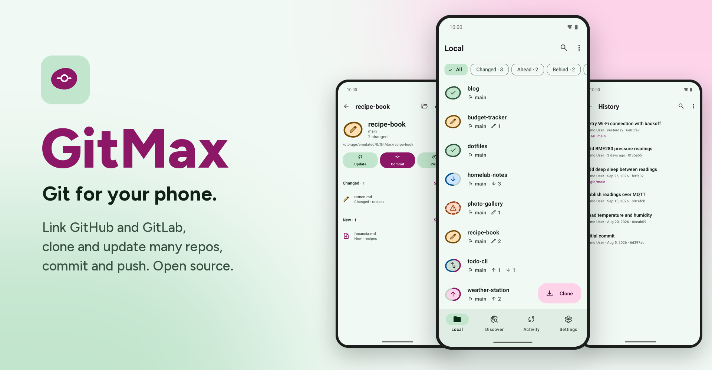

</div>

---

## Inhalt

- [Warum GitMax](#warum-gitmax)
- [Screenshots](#screenshots)
- [Funktionen](#funktionen)
- [Installieren](#installieren)
- [Erste Schritte](#erste-schritte)
- [So funktioniert es](#so-funktioniert-es)
- [Sicherheit und Datenschutz](#sicherheit-und-datenschutz)
- [Grenzen](#grenzen)
- [Bauen und testen](#bauen-und-testen)
- [Projektaufbau](#projektaufbau)
- [Technik](#technik)
- [Mitwirken](#mitwirken)
- [Lizenz](#lizenz)

## Warum GitMax

Die meisten Git-Apps für Android verstecken deine Repos im privaten App-Speicher oder machen aus dem Klonen von zehn Repos zehn Handgriffe. GitMax ist um die vier Dinge gebaut, die du unterwegs wirklich tust (**Klonen, Update, Commit, Push**); alles andere liegt eine Ebene tiefer.

- 📁 **Ein Ordner, alle Repos.** Repos liegen als normale Ordner in einem öffentlichen Verzeichnis (standardmäßig `/GitMax`), damit Dateimanager, Editoren und Termux sie auch sehen.
- 📦 **Alles gebündelt.** Wähle in „Entdecken“ ein Dutzend Repos und klone sie in einem Zug; mit **Alle aktualisieren** ziehen alle Repos nach. Ein Konflikt in einem Repo hält die anderen nie auf.
- 🪨 **Status auf einen Blick.** Jedes Repo ist ein Kieselstein, dessen Ring den Zustand zeigt (sauber, geändert, voraus, zurück, auseinandergelaufen, Konflikt) und beim Klonen oder Aktualisieren zugleich die Fortschrittsanzeige ist.
- 🔐 **Token oder SSH.** Personal Access Tokens je Konto oder SSH-Schlüssel, die auf dem Gerät erzeugt und gespeichert werden. Geheimnisse verlassen den Android Keystore nie.
- 🌗 **Fürs Handy gemacht.** Material 3, Hell und Dunkel, dynamische Farben als Option, Tablet-Layout, geeignet für große Schrift, Englisch und Deutsch.

## Screenshots

> Alle Screenshots zeigen erfundene Demo-Repositories und einen lokalen Testserver, kein echtes Konto.

<table>
  <tr>
    <td align="center" width="25%">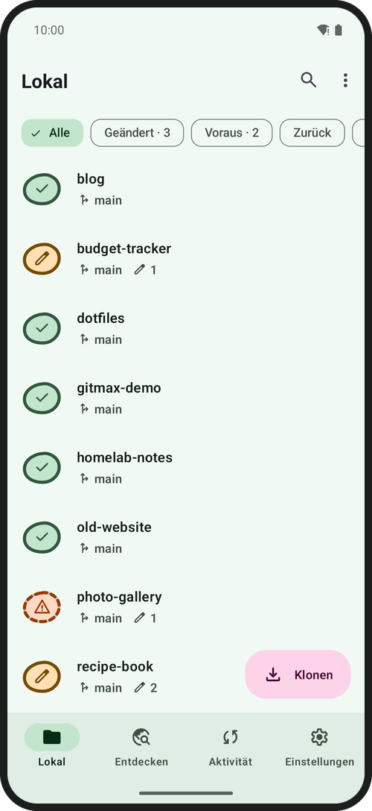<br><sub><b>Lokal</b><br>jedes Repo und sein Zustand</sub></td>
    <td align="center" width="25%">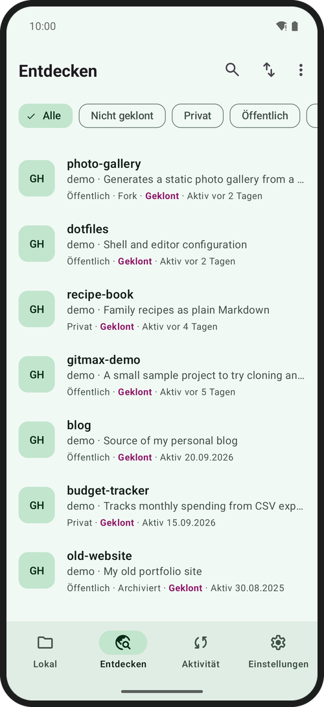<br><sub><b>Entdecken</b><br>Repos aller verknüpften Konten</sub></td>
    <td align="center" width="25%">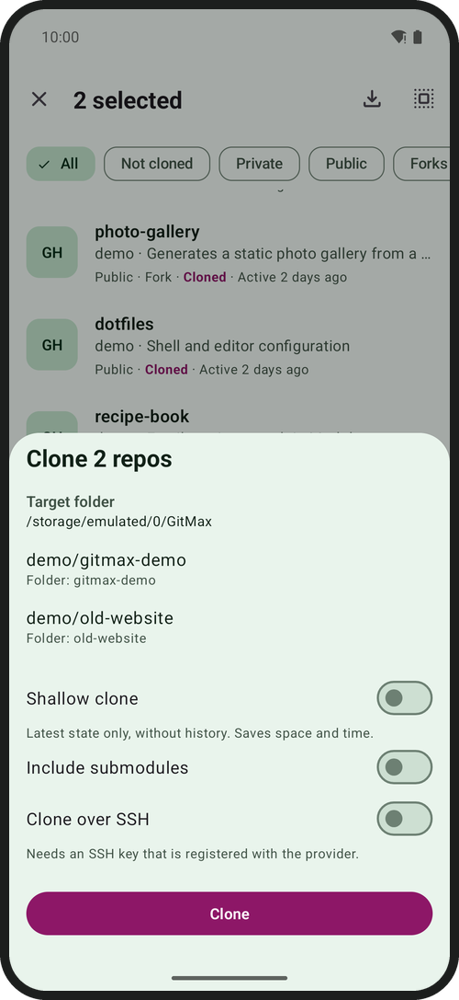<br><sub><b>Klonen</b><br>eins oder viele, in einen Ordner</sub></td>
    <td align="center" width="25%">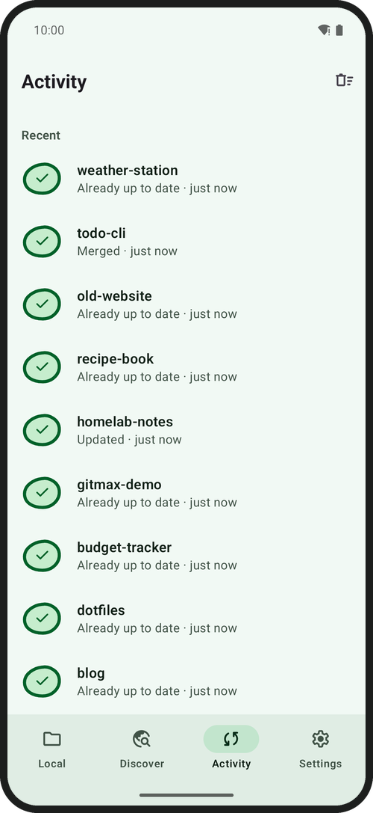<br><sub><b>Aktivität</b><br>Fortschritt, Ergebnis, Wiederholen</sub></td>
  </tr>
  <tr>
    <td align="center">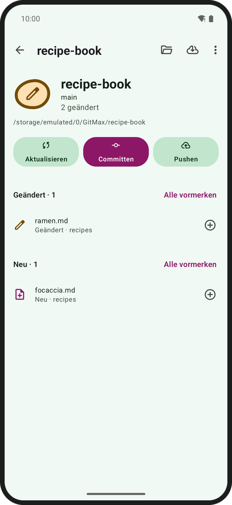<br><sub><b>Repo</b><br>Aktualisieren · Committen · Pushen</sub></td>
    <td align="center">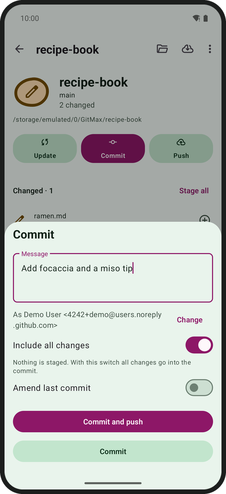<br><sub><b>Commit</b><br>vormerken, ändern, committen und pushen</sub></td>
    <td align="center">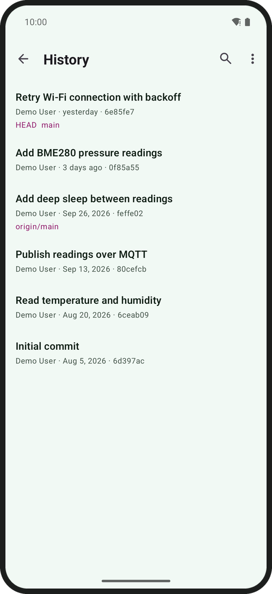<br><sub><b>Verlauf</b><br>filtern nach Autor, Pfad, Text</sub></td>
    <td align="center">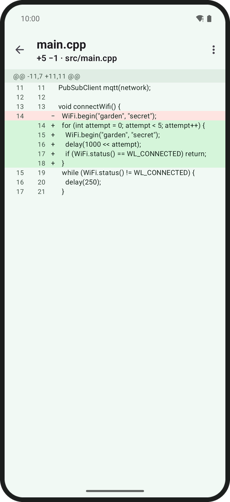<br><sub><b>Diff</b><br>untereinander oder nebeneinander</sub></td>
  </tr>
  <tr>
    <td align="center">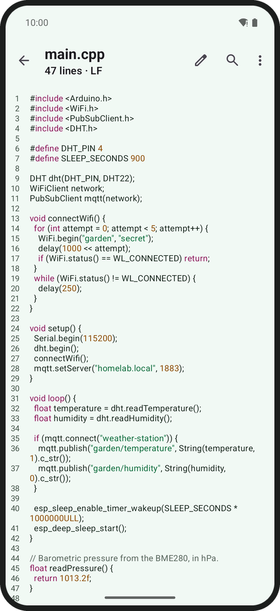<br><sub><b>Viewer</b><br>Syntaxfärbung, Suche</sub></td>
    <td align="center"><br><sub><b>Editor</b><br>Speichern und Committen in einem Schritt</sub></td>
    <td align="center">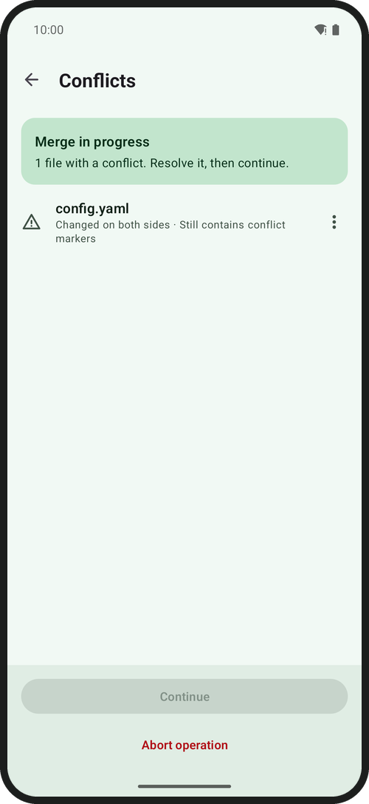<br><sub><b>Konflikte</b><br>meine, andere, beide oder von Hand</sub></td>
    <td align="center">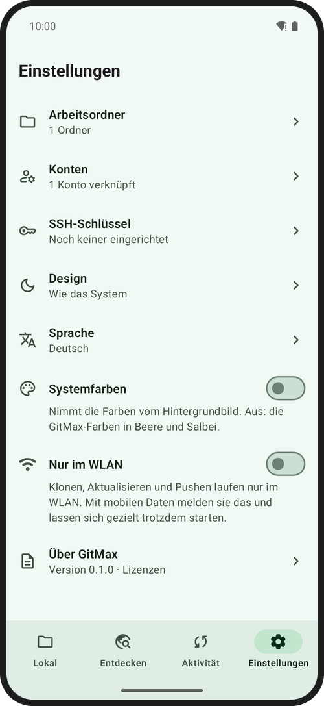<br><sub><b>Einstellungen</b><br>Design, Sprache, nur im WLAN</sub></td>
  </tr>
</table>

<div align="center">
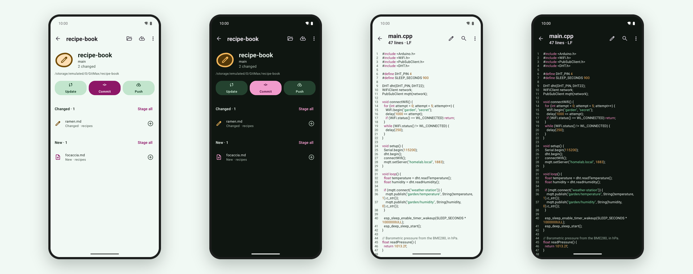
</div>

<details>
<summary><b>Mehr: Tablet-Layout</b></summary>
<br>
<p align="center">
  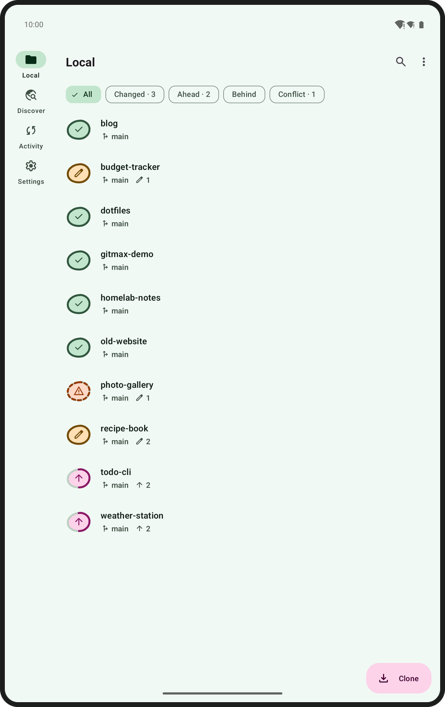
</p>
</details>

> Die Bildschirme mit englischem Text (Klon-Sheet, Aktivität, Commit, Verlauf, Diff, Viewer, Editor, Konflikte) zeigen dieselbe App in der englischen Oberfläche.

## Funktionen

**Die vier Standardhandlungen sind nie mehr als zwei Tipper entfernt**

| Aktion | Was sie tut |
|---|---|
| **Klonen** | Ein oder mehrere Repos aus *Entdecken* in einen Zielordner (`Ordner/Repo`, bei Namenskollision `Ordner/Repo-besitzer`). Auch per Adresse oder über *Teilen* aus einer anderen App. Läuft in einem Vordergrunddienst weiter, wenn die App im Hintergrund ist. Flach klonen, Submodule und SSH sind Optionen. |
| **Update** | `fetch --prune`, dann Fast-Forward, Merge oder Rebase (je Repo einstellbar). Stehen lokale Änderungen im Weg: *Zwischenspeichern und aktualisieren* oder Abbruch. *Alle aktualisieren* mit einem Tipp. Konflikte laufen nie still durch und halten einen Sammel-Update nie an. |
| **Commit** | Dateien einzeln vormerken oder alles mitnehmen, Commit-Identität pro Repo oder Konto, Amend. *Committen und pushen* in einem Schritt. |
| **Push** | Aktueller Branch zum Upstream. Ist der Remote inzwischen weiter, heißt es „Erst aktualisieren“, nie ein stiller Force-Push. *Push erzwingen* (Repo-Menü, nach Eintippen des Repo-Namens) gibt es für geänderten oder neu aufgesetzten Verlauf; er überschreibt nur, wenn der Remote noch dem zuletzt abgerufenen Stand entspricht. |

**Erweitert** (Repo-Menü › Erweitert)

Verlauf mit Filtern und Diff · Branches (wechseln, anlegen, umbenennen, löschen, zusammenführen, aufsetzen) · Stash · Tags · Remotes (auch zwischen https und ssh umstellen) · Konfliktlösung (meine Fassung, die andere, beide oder von Hand; fortsetzen, überspringen, abbrechen) · Reset, Revert, Cherry-pick · Submodule · `.gitignore` und persönliche Ausschlüsse · nicht verfolgte Dateien entfernen · Git-Daten verdichten · Blame · neues Repo (lokal und beim Anbieter anlegen, erster Push) · SSH-Schlüssel und bekannte Server · Repo vom Gerät löschen.

**Dateien:** Dateibaum mit Git-Markierungen, Viewer und einfacher Editor (Zeilennummern, Suchen und Ersetzen, Syntaxfärbung, Zeilenenden und BOM bleiben erhalten, Speichern atomar) und *Speichern und committen*.

**Einstellungen:** Arbeitsordner, Konten, SSH-Schlüssel, Design (System, Hell, Dunkel), Systemfarben, Sprache (System, English, Deutsch), *Nur im WLAN* für Übertragungen, Lizenzen.

## Installieren

GitMax wird als Quellcode verteilt. Baue die APK selbst und installiere sie („Installation aus unbekannten Quellen“ muss für die App erlaubt sein, mit der du sie öffnest, oder nimm `adb`):

```bash
git clone https://github.com/lembergmax/GitMax.git
cd GitMax
./gradlew assembleDebug          # build/outputs/apk/debug/GitMax-debug.apk
adb install -r build/outputs/apk/debug/GitMax-debug.apk
```

Voraussetzungen: JDK 21 und das Android SDK (Plattform 36, Build-Tools 36.1.0); der SDK-Pfad steht in `local.properties` (`sdk.dir=…`). Unter Windows `gradlew.bat`. Ein signierter Release-Build braucht einen eigenen Keystore, siehe [Bauen und testen](#bauen-und-testen).

> **Stand:** GitMax 0.1.0 ist eine erste Fassung. Sie wurde auf einem Android-15-Emulator gegen lokale Testserver (HTTP und SSH) entwickelt und geprüft. Echte GitHub- und GitLab-Konten und echte Geräte werden noch getestet; rechne mit Ecken und Kanten und melde, was dir auffällt.

## Erste Schritte

1. **Arbeitsordner wählen.** Beim ersten Start bietet *Lokal* an, den Ordner `GitMax` im Telefonspeicher anzulegen, und führt zur Freigabe **Zugriff auf alle Dateien**. Repos liegen dort als echte Ordner, damit andere Apps sie sehen. Ohne die Freigabe kann GitMax sie nicht lesen und sagt das mit einem Knopf zur Systemeinstellung.
2. **Konto verbinden** (Einstellungen › Konten). *Token erstellen* öffnet die Token-Seite des Anbieters mit vorgeschlagenen Rechten (GitHub klassisch: `repo`, `workflow`; GitLab: `api`, `read_repository`, `write_repository`); füge den Token ein. Selbst gehostetes GitLab und GitHub Enterprise gehen mit eigener Adresse.
3. **Klonen.** Öffne *Entdecken*, halte ein Repo gedrückt, um die Auswahl zu beginnen, wähle weitere, tippe auf *Klonen*.
4. **Arbeiten.** Ändere Dateien mit einer beliebigen App oder dem eingebauten Editor, öffne dann das Repo, *Committen*, *Pushen*.
5. **Optional: SSH.** Einstellungen › SSH-Schlüssel: Ed25519- (oder RSA-4096-)Schlüssel erzeugen oder importieren, den öffentlichen Schlüssel beim Anbieter hinterlegen und *Über SSH klonen* wählen. Beim ersten Kontakt mit einem Server zeigt GitMax dessen Fingerabdruck; ein geänderter Server-Schlüssel ist ein harter Fehler. Die Fingerabdrücke von github.com und gitlab.com sind vorbekannt.

Die Oberfläche folgt deiner Systemsprache (Englisch oder Deutsch). Nur für GitMax ändern: Einstellungen › Sprache oder die App-Sprache in den Android-Einstellungen.

## So funktioniert es

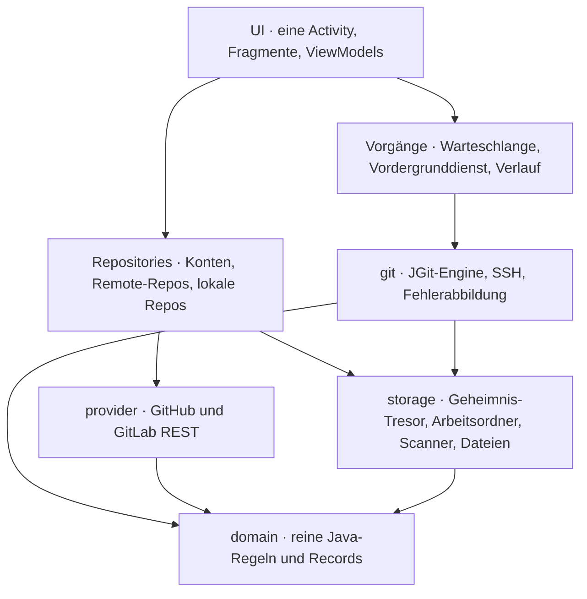

- **Engine:** [JGit](https://www.eclipse.org/jgit/) 7.8 mit Apache MINA SSHD; es wird kein `git`-Programm mitgeliefert oder gebraucht. Alles läuft hinter einer kleinen `GitEngine`-Schnittstelle und ist gegen lokale Bare-Repos, eine Fake-Anbieter-API und einen echten Apache-MINA-SSH-Testserver getestet; HTTP-Übertragungen wurden zusätzlich Ende-zu-Ende gegen `git http-backend` geprüft.
- **Vorgänge:** ein Klon zugleich, zwei andere Vorgänge parallel, höchstens einer je Repo-Ordner. Sie laufen in einem `dataSync`-Vordergrunddienst mit Fortschritts-Benachrichtigung und Abbrechen-Aktion, mit einem Wakelock nur, solange gearbeitet wird.
- **Eigenheiten des Telefonspeichers** nimmt GitMax dir ab: keine Symlinks, keine Hardlinks, keine Dateinamen mit `: ? * " < > | \`. Klone werden mit `core.symlinks=false` und `core.fileMode=false` ausgecheckt, halbe Klone werden aufgeräumt (auch nach einem Absturz), und ein Repo mit verbotenen Dateinamen wird gemeldet, statt Unordnung zu hinterlassen.
- **Zustand ist ausdrücklich:** ViewModels halten ihren Zustand nur auf dem Hauptthread; Hintergrundarbeit meldet mit vollständigen Momentaufnahmen zurück, nie mit Änderungen.

## Sicherheit und Datenschutz

- Token und SSH-Schlüssel liegen **ausschließlich** im `SecretVault`, verschlüsselt mit einem Android-Keystore-Schlüssel (AES-256-GCM, der Name des Geheimnisses ist als zusätzlich authentifizierte Daten gebunden). Sie stehen nie in Logs, Remote-URLs, `.git/config`, Backups oder Fehlermeldungen; Remote-Adressen werden von Zugangsdaten bereinigt.
- Zugangsdaten gehen nur an den Host des Kontos, zu dem sie gehören; eine Weiterleitung auf einen fremden Host bekommt deinen Token nie. HTTP-Weiterleitungen werden nur für `GET` und nur auf demselben Host verfolgt.
- Cloud-Sicherung und Geräte-Übertragung sind ganz abgeschaltet (`allowBackup=false`, leere Extraktionsregeln). Die Eingabe einer SSH-Passphrase sperrt Bildschirmfotos.
- Keine Analyse, keine Absturzberichte, keine Werbung. Netzwerkverkehr geht nur zu deinen Git-Servern und den Schnittstellen der Anbieter. Klartext-HTTP ist im Release verboten.
- Zerstörerische Aktionen fragen vorher und sagen, was verloren geht; die unumkehrbaren (Push erzwingen, vom Gerät löschen) verlangen das Eintippen des Repo-Namens.
- *Nur im WLAN* (Einstellungen) hält Übertragungen bei mobilen Daten an, bis du *Trotzdem versuchen* wählst.

## Grenzen

- **Git LFS** wird nicht unterstützt. LFS-Dateien bleiben kleine Zeiger-Dateien, die Oberfläche weist darauf hin (Befund des Spikes in [`CLAUDE.md`](CLAUDE.md)).
- Keine Git-Hooks (JGit führt keine aus), keine GPG-Signierung, kein Partial Clone, kein interaktives Rebase.
- Der Telefonspeicher verbietet Symlinks, Hardlinks und einige Zeichen in Dateinamen; ein Repo mit solchen Dateien lässt sich nicht klonen.
- Dateien über 2 MiB öffnet der Viewer nur auf Nachfrage und langsam; der Editor bearbeitet bis etwa 1 MiB.
- Lange Klone sind durch Telefon und Netz begrenzt; „flach“ (nur der letzte Stand) spart Zeit und Platz.
- GitMax braucht die Freigabe **Zugriff auf alle Dateien**, um Repos in einem öffentlichen Ordner abzulegen. Einen Ausweichordner im privaten App-Speicher gibt es nicht.

## Bauen und testen

JDK 21 und das Android SDK sind nötig (`sdk.dir` in `local.properties`). Das Plugin liegt auf dem Wurzelprojekt, die Aufgaben sind unpräfixiert:

```bash
./gradlew assembleDebug                 # Debug-APK
./gradlew testDebugUnitTest             # JVM-Tests: JGit gegen lokale Bare-Repos, eine Fake-Anbieter-API, ein SSH-Testserver
./gradlew lintDebug                     # Lint; Fehler brechen ab
./gradlew connectedDebugAndroidTest     # Gerätetests auf Emulator oder Gerät (echter Telefonspeicher)
./gradlew assembleRelease               # R8-geschrumpfte Release-APK (ohne Keystore unsigniert)
```

Führe die Gerätetests auch gegen das geschrumpfte und obfuskierte Paket aus (JGit und SSHD nutzen Reflection und `ServiceLoader`, was R8 brechen kann; die Keep-Regeln stehen in `proguard-rules.pro`):

```bash
./gradlew -PtestBuildType=minified connectedMinifiedAndroidTest
```

> Hängt ein echtes Handy am Rechner, läuft `connected…AndroidTest` auf **jedem** angeschlossenen Gerät und deinstalliert die App danach. Wähle mit `ANDROID_SERIAL` eines aus.

**Signierter Release.** Die Signierangaben stehen in `local.properties` (oder als Umgebungsvariablen) und nicht im Repo:

```properties
RELEASE_STORE_FILE=C\:\\Pfad\\zu\\deinem-release.jks
RELEASE_STORE_PASSWORD=…
RELEASE_KEY_ALIAS=dein-alias
RELEASE_KEY_PASSWORD=…
```

Bewahre den Keystore sicher auf: Jedes Update muss mit demselben Schlüssel signiert sein, und die verschlüsselten Konten hängen an der Installation (nach einer Neuinstallation musst du sie neu verknüpfen).

## Projektaufbau

```
src/main/java/de/lembergmax/gitmax/
├── domain/      reine Regeln ohne Android: Records, Namen, Klon-Planung, Lizenz- und LFS-Erkennung, Syntaxfärbung
├── provider/    GitHub- und GitLab-API (HttpURLConnection, Paginierung, Fehlerabbildung)
├── git/         JGit-Engine, Fehlerabbildung, Verlauf/Branches/Stash/Konflikte/Blame, SSH (git/ssh)
├── storage/     Geheimnis-Tresor, Konten, Arbeitsordner, Repo-Scanner, Dateizugriff, Einstellungen
├── ops/         Vorgangs-Warteschlange, Verlauf, Vordergrunddienst, Benachrichtigungen, Netz-Regel
├── repository/  Konten, Remote-Repos und lokale Repos im Zusammenspiel
└── ui/          eine Activity, Fragmente, ViewModels
```

Die Schichten zeigen strikt nach unten: UI → ViewModel → Repository/Ops → git | provider | storage → domain. Hinweise zum Arbeiten am Code (Konventionen, Fallen, Entscheidungen) stehen in [`CLAUDE.md`](CLAUDE.md), der Produktkontext in [`PRODUCT.de.md`](PRODUCT.de.md), das gebaute Design in [`DESIGN.de.md`](DESIGN.de.md).

> Quellcode-Kommentare und `CLAUDE.md` sind deutsch; Bezeichner und alle Oberflächentexte sind englisch mit deutscher Übersetzung (`values/` und `values-de/`).

## Technik

Java 21 · Android Gradle Plugin 8.13 · Material 3 mit XML-Views (kein Kotlin, kein Compose) · eine Activity mit der Navigation-Komponente · JGit 7.8 und Apache MINA SSHD · EdDSA-Java für Ed25519 · SLF4J · minSdk 34, targetSdk 36 · Schriften Figtree und Commit Mono · Symbole aus Material Symbols.

## Mitwirken

Issues und Pull Requests sind willkommen. Bitte halte `domain/` frei von Android-Importen, ergänze Tests für Änderungen an Engine und Domäne und trage jeden neuen Oberflächentext sowohl in `values/strings.xml` als auch in `values-de/strings.xml` ein.

## Lizenz

[MIT](LICENSE) © 2026 Max Lemberg.

GitMax baut auf freier Software auf: JGit (Eclipse Distribution License 1.0), Apache MINA SSHD, JavaEWAH und AndroidX / Material Components (Apache 2.0), EdDSA-Java (CC0), SLF4J (MIT), die Schriften Figtree und Commit Mono (SIL OFL 1.1) und Material Symbols (Apache 2.0). Die Texte stehen in der App unter Einstellungen › Über GitMax.
