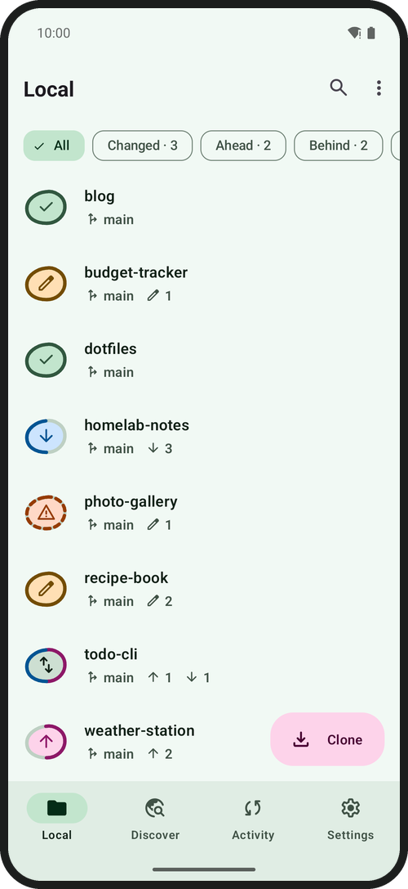
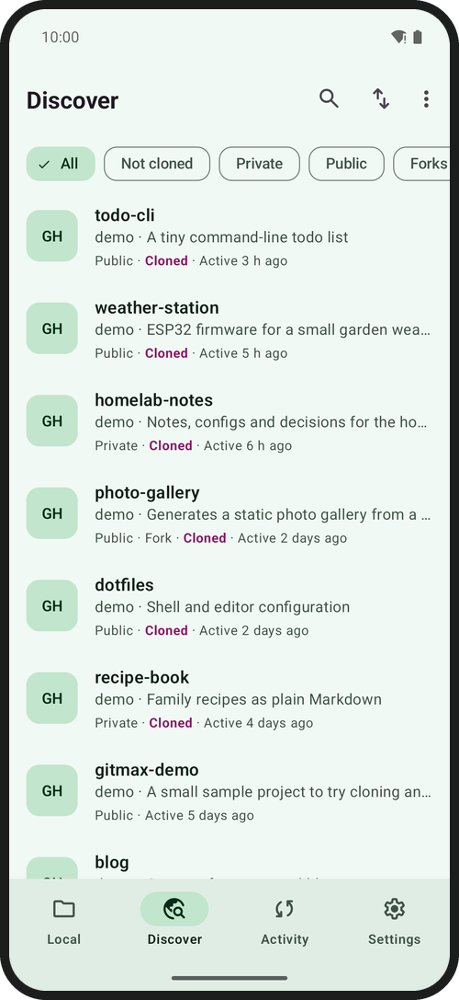
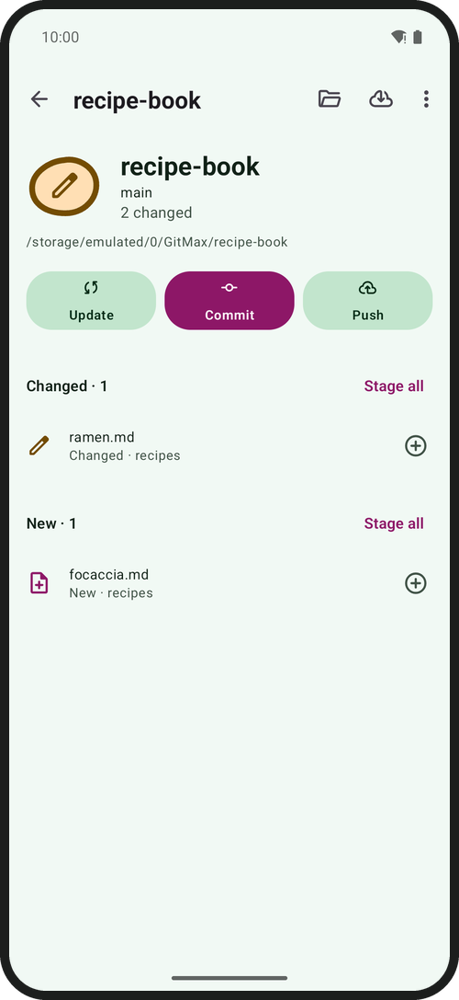
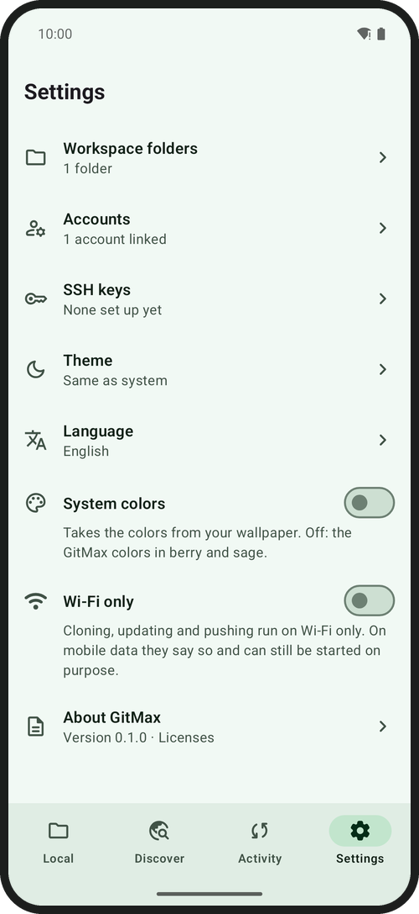
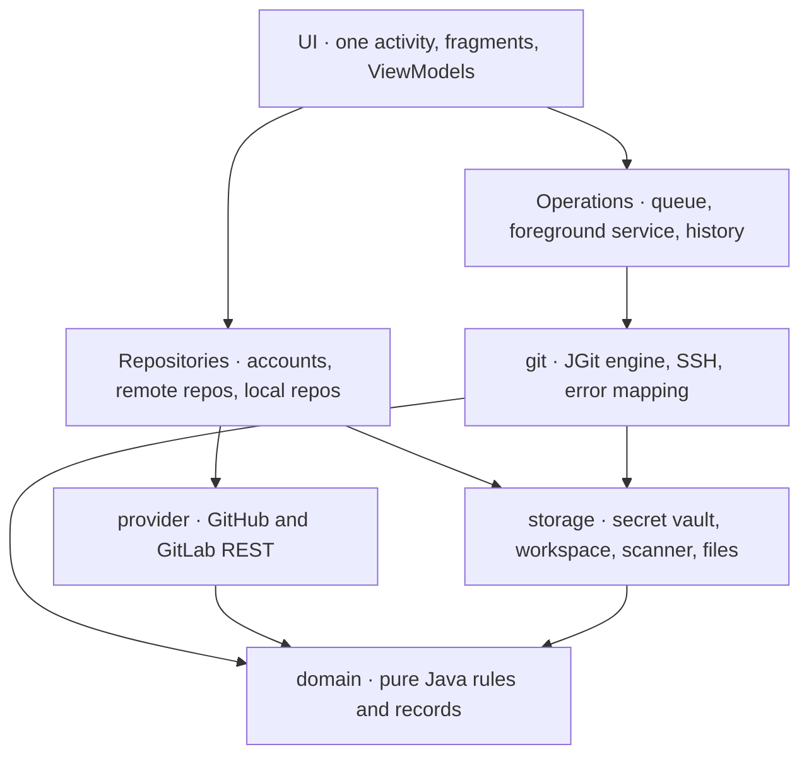

<div align="center">


# GitMax

**A personal Git client for Android.**<br>
Link GitHub and GitLab, clone and update many repos into one folder, review changes, commit and push, all from your phone.

[](#install)
[](#build-and-test)
[](https://www.eclipse.org/jgit/)
[](LICENSE)

**English** · [Deutsch](README.de.md)


</div>

---

## Contents

- [Why GitMax](#why-gitmax)
- [Screenshots](#screenshots)
- [Features](#features)
- [Install](#install)
- [First steps](#first-steps)
- [How it works](#how-it-works)
- [Security and privacy](#security-and-privacy)
- [Limitations](#limitations)
- [Build and test](#build-and-test)
- [Project structure](#project-structure)
- [Tech stack](#tech-stack)
- [Contributing](#contributing)
- [License](#license)

## Why GitMax

Most Git apps for Android either hide your repos inside private app storage or make cloning ten repos a ten-times chore. GitMax is built around the four things you actually do on the go (**clone, update, commit, push**) and keeps everything else one level deeper.

- 📁 **One folder, all your repos.** Repos live as plain folders in a public directory (`/GitMax` by default), so file managers, editors and Termux see them too.
- 📦 **Batch everything.** Select a dozen repos in Discover and clone them in one go; hit **Update all** and every repo catches up. A conflict in one repo never stops the others.
- 🪨 **Status at a glance.** Every repo is a pebble whose ring shows the state (clean, changed, ahead, behind, diverged, conflict) and doubles as the progress ring while it clones or updates.
- 🔐 **Token or SSH.** Personal access tokens per account, or SSH keys generated and stored on the device. Secrets never leave the Android Keystore.
- 🌗 **Made for the phone.** Material 3, light and dark, dynamic colours as an option, tablet layout, large-font friendly, English and German.

## Screenshots

> All screenshots show synthetic demo repositories and a local test server, not a real account.

<table>
  <tr>
    <td align="center" width="25%"><br><sub><b>Local</b><br>every repo and its state</sub></td>
    <td align="center" width="25%"><br><sub><b>Discover</b><br>repos of all linked accounts</sub></td>
    <td align="center" width="25%"><br><sub><b>Clone</b><br>one or many, into one folder</sub></td>
    <td align="center" width="25%"><br><sub><b>Activity</b><br>progress, results, retries</sub></td>
  </tr>
  <tr>
    <td align="center"><br><sub><b>Repo</b><br>Update · Commit · Push</sub></td>
    <td align="center"><br><sub><b>Commit</b><br>stage, amend, commit and push</sub></td>
    <td align="center"><br><sub><b>History</b><br>filter by author, path, text</sub></td>
    <td align="center"><br><sub><b>Diff</b><br>unified or side by side</sub></td>
  </tr>
  <tr>
    <td align="center"><br><sub><b>Viewer</b><br>syntax colouring, search</sub></td>
    <td align="center"><br><sub><b>Editor</b><br>save and commit in one step</sub></td>
    <td align="center"><br><sub><b>Conflicts</b><br>mine, theirs, both, or by hand</sub></td>
    <td align="center"><br><sub><b>Settings</b><br>theme, language, Wi-Fi only</sub></td>
  </tr>
</table>

<div align="center">

</div>

<details>
<summary><b>More: tablet layout and German interface</b></summary>
<br>
<p align="center">
  
</p>
<p align="center">
  
  
  
</p>
</details>

## Features

**The four standard actions are never more than two taps away**

| Action | What it does |
|---|---|
| **Clone** | One or many repos from *Discover* into one target folder (`Folder/Repo`; on a name clash `Folder/Repo-owner`). Also by URL, or via *Share* from another app. Continues in a foreground service when the app is in the background. Shallow clone, submodules and SSH are options. |
| **Update** | `fetch --prune`, then fast-forward, merge or rebase (set per repo). If local changes are in the way: *stash and update* or stop. *Update all* in one tap. Conflicts never pass silently and never stop a batch. |
| **Commit** | Stage files one by one or take everything along, commit identity per repo or account, amend. *Commit and push* in one step. |
| **Push** | Current branch to its upstream. If the remote moved on you are told to update first, never a silent force push. *Force push* (repo menu, after typing the repo name) exists for amended or rebased history and only overwrites if the remote still matches what you last fetched. |

**Advanced** (repo menu › Advanced)

History with filters and diff · branches (switch, create, rename, delete, merge, rebase) · stash · tags · remotes (also switch between https and ssh) · conflict resolution (my version, theirs, both, or edit by hand; continue, skip or abort) · reset, revert, cherry-pick · submodules · `.gitignore` and personal excludes · remove untracked files · compact Git data · blame · create a new repo (locally and at the provider, with first push) · SSH keys and known servers · delete a repo from the device.

**Files:** file tree with Git markers, viewer and a simple editor (line numbers, find and replace, syntax colouring, line endings and BOM are preserved, atomic saves) and *Save and commit*.

**Settings:** workspace folders, accounts, SSH keys, theme (system, light, dark), system colours, language (system, English, Deutsch), *Wi-Fi only* for transfers, licences.

## Install

GitMax is distributed as source. Build the APK yourself and install it (*Install from unknown sources* has to be allowed for the app you open it with, or use `adb`):

```bash
git clone https://github.com/lembergmax/GitMax.git
cd GitMax
./gradlew assembleDebug          # build/outputs/apk/debug/GitMax-debug.apk
adb install -r build/outputs/apk/debug/GitMax-debug.apk
```

Requirements: JDK 21 and the Android SDK (platform 36, build-tools 36.1.0); put the SDK path into `local.properties` (`sdk.dir=…`). On Windows use `gradlew.bat`. A signed release build needs your own keystore, see [Build and test](#build-and-test).

> **Status:** GitMax 0.1.0 is a first release. It was developed and tested on an Android 15 emulator against local test servers (HTTP and SSH). Real GitHub and GitLab accounts and physical devices are still being tested, so expect rough edges and please report what you find.

## First steps

1. **Choose a workspace folder.** On first start *Local* offers to create the folder `GitMax` in your phone storage and guides you to the **All files access** permission. Repos are real folders there so other apps can see them. Without the permission GitMax cannot read them and says so with a button to the system setting.
2. **Connect an account** (Settings › Accounts). *Create token* opens the provider's token page with suggested scopes (GitHub classic: `repo`, `workflow`; GitLab: `api`, `read_repository`, `write_repository`); paste the token. Self-hosted GitLab and GitHub Enterprise work with their own address.
3. **Clone.** Open *Discover*, long-press a repo to start selecting, pick more, tap *Clone*.
4. **Work.** Change files with any app or the built-in editor, then open the repo, *Commit*, *Push*.
5. **Optional: SSH.** Settings › SSH keys: generate an Ed25519 (or RSA 4096) key or import one, register the public key with your provider, and choose *Clone over SSH*. On first contact with a server GitMax shows its fingerprint; a changed server key is a hard error. The fingerprints of github.com and gitlab.com are known in advance.

The interface follows your system language (English or German). To change it for GitMax only: Settings › Language, or Android's per-app language setting.

## How it works



- **Engine:** [JGit](https://www.eclipse.org/jgit/) 7.8 with Apache MINA SSHD; no `git` binary is bundled or needed. Everything runs behind a small `GitEngine` interface and is tested against local bare repos, a fake provider API and a real Apache MINA SSH test server; HTTP transfers were also verified end to end against `git http-backend`.
- **Operations:** one clone at a time, two other operations in parallel, one per repo folder. They run in a `dataSync` foreground service with a progress notification and a *Cancel* action, with a wake lock only while work is running.
- **Phone storage quirks** are handled for you: no symlinks, no hard links, no file names with `: ? * " < > | \`. Clones are checked out with `core.symlinks=false` and `core.fileMode=false`, half-finished clones are cleaned up (also after a crash), and a repo with forbidden file names is reported instead of leaving a mess.
- **State is explicit:** ViewModels hold their state on the main thread only; background work reports back with complete snapshots, never deltas.

## Security and privacy

- Tokens and SSH keys live **only** in the `SecretVault`, encrypted with an Android Keystore key (AES-256-GCM, the secret's name is bound as associated data). They never appear in logs, remote URLs, `.git/config`, backups or error messages; remote URLs are stripped of credentials.
- Credentials are only handed to the host of the account they belong to, so a redirect to a foreign host cannot receive your token. HTTP redirects are followed only for `GET` and only on the same host.
- Cloud backup and device-to-device transfer are switched off completely (`allowBackup=false`, empty extraction rules). SSH passphrase prompts block screenshots.
- No analytics, no crash reporting, no ads. Network traffic goes only to your Git hosts and the providers' APIs.
- **HTTPS is the default and the rule.** Plain `http://` exists only for a self-hosted server that offers no HTTPS: you enter it as `http://address` when connecting, GitMax asks you to confirm the unencrypted connection, and the account shows a warning. It is never possible for github.com or gitlab.com, and your token is never sent over HTTP to any server that you did not connect that way.
- Destructive actions ask first and say what is lost; the irreversible ones (force push, delete from device) ask you to type the repo name.
- *Wi-Fi only* (Settings) stops transfers on mobile data until you choose *Try anyway*.

## Limitations

- **Git LFS** is not supported. LFS files stay small pointer files, and the interface says so (findings of the spike are in [`CLAUDE.md`](CLAUDE.md)).
- No Git hooks (JGit runs none), no GPG signing, no partial clone, no interactive rebase.
- Phone storage forbids symlinks, hard links and some characters in file names; a repo containing such files cannot be cloned.
- Files over 2 MiB open in the viewer only on request and slowly; the editor handles up to about 1 MiB.
- Cloning is limited by phone and network; *shallow* (latest state only) saves time and space.
- GitMax needs the **All files access** permission to keep repos in a public folder. There is no fallback to private app storage.

## Build and test

JDK 21 and the Android SDK are required (`sdk.dir` in `local.properties`). The plugin sits on the root project, tasks are unprefixed:

```bash
./gradlew assembleDebug                 # debug APK
./gradlew testDebugUnitTest             # JVM tests: JGit against local bare repos, a fake provider API, an SSH test server
./gradlew lintDebug                     # lint; errors fail the build
./gradlew connectedDebugAndroidTest     # instrumented tests on an emulator or device (real phone storage)
./gradlew assembleRelease               # R8-shrunk release APK (unsigned without a keystore)
```

Run the instrumented tests against the shrunk and obfuscated package too (JGit and SSHD rely on reflection and `ServiceLoader`, which R8 can break; the keep rules live in `proguard-rules.pro`):

```bash
./gradlew -PtestBuildType=minified connectedMinifiedAndroidTest
```

> With a physical phone attached, `connected…AndroidTest` runs on **every** attached device and uninstalls the app afterwards. Set `ANDROID_SERIAL` to pick one.

**Signed release.** Signing details are read from `local.properties` (or environment variables) and are not part of the repo:

```properties
RELEASE_STORE_FILE=C\:\\path\\to\\your-release.jks
RELEASE_STORE_PASSWORD=…
RELEASE_KEY_ALIAS=your-alias
RELEASE_KEY_PASSWORD=…
```

Keep the keystore safe: every update has to be signed with the same key, and the encrypted accounts are tied to the installation (after a reinstall you have to link your accounts again).

## Project structure

```
src/main/java/de/lembergmax/gitmax/
├── domain/      pure rules, no Android: records, naming, clone planning, licence and LFS detection, syntax colouring
├── provider/    GitHub and GitLab APIs (HttpURLConnection, pagination, error mapping)
├── git/         JGit engine, error mapping, history/branches/stash/conflicts/blame, SSH (git/ssh)
├── storage/     secret vault, accounts, workspace folders, repo scanner, file access, settings
├── ops/         operation queue, history, foreground service, notifications, network rule
├── repository/  accounts, remote repos and local repos working together
└── ui/          one activity, fragments, ViewModels
```

Layers point strictly downward: UI → ViewModel → repository/ops → git | provider | storage → domain. Notes for working on the code (conventions, pitfalls, decisions) are in [`CLAUDE.md`](CLAUDE.md); product context in [`PRODUCT.md`](PRODUCT.md), the built design in [`DESIGN.md`](DESIGN.md).

> Source comments and `CLAUDE.md` are in German; identifiers and all user-facing texts are English with a German translation (`values/` and `values-de/`).

## Tech stack

Java 21 · Android Gradle Plugin 8.13 · Material 3 with XML views (no Kotlin, no Compose) · one activity with the Navigation component · JGit 7.8 and Apache MINA SSHD · EdDSA-Java for Ed25519 · SLF4J · minSdk 34, targetSdk 36 · typefaces Figtree and Commit Mono · icons from Material Symbols.

## Contributing

Issues and pull requests are welcome. Please keep `domain/` free of Android imports, add tests for engine and domain changes, and add every new user-facing text to both `values/strings.xml` and `values-de/strings.xml`.

## License

[MIT](LICENSE) © 2026 Max Lemberg.

GitMax builds on free software: JGit (Eclipse Distribution License 1.0), Apache MINA SSHD, JavaEWAH and AndroidX / Material Components (Apache 2.0), EdDSA-Java (CC0), SLF4J (MIT), the typefaces Figtree and Commit Mono (SIL OFL 1.1) and Material Symbols (Apache 2.0). The texts are in the app under Settings › About GitMax.
